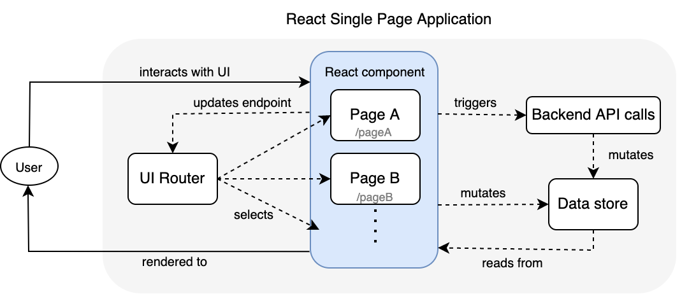

# Frontend Development Guide

[Material UI v5](https://mui.com/) is the framework being used in this project. It is built on top of the [Soft UI Dashboard](https://www.creative-tim.com/product/soft-ui-dashboard-react) theme developed by Creative Tim.

For those unfamiliar with Material UI (MUI), it is highly suggested that you go through the basic [documentation](https://mui.com/getting-started/learn/).

Soft UI Dashboard (SUI) codebase that can be download [here](https://www.creative-tim.com/product/soft-ui-dashboard-react). It is highly suggested that you go through the codebase to understand the patterns that are used how to project is structured. [Reference documentation](https://www.creative-tim.com/learning-lab/react/colors/soft-ui-dashboard)

When creating a new component here are the following guidelines to follow:
  
* Components will be created in the `src/components/` folder as a folder with a mandatory `index.js` file. The folder name will be in *PascalCase*. `index.js` will contain the `export` statement of the component. If there significant amount of styling then it should be in a separate `styles.js` file.
  
* All components must implement props type checking. An example can be found in `src/components/BreadCrumbs` component.

* To apply css to a component use the [`makeStyles`](https://mui.com/styles/api/#makestyles-styles-options-hook) MUI function. To apply custom CSS to specific MUI (or SUI) nested component use the `SuiBox` wrapper component. It is built on top of the [`Box`](https://mui.com/components/box/#main-content) mui component.

* Before creating a new component, check the SUI dashboard codebase to see if it is already implemented. Try as much as possible to reuse those components.

* When creating CSS styles use only the theme colors, NEVER use hardcoded color specification. In the `SuiBox` component there is a `color` prop that takes only specific values like *primary, secondary...etc*. These strings map to a color that is specified in the base theme defined in `assets/theme` folder. You can find all the valid color strings in the SUI reference [documentation](https://www.creative-tim.com/learning-lab/react/colors/soft-ui-dashboard).

* For text styling & sizing use the `SuiTypography` component. Don't use HTML5 tags like `
, <h6>...etc`.

## Project Structure

* `src/` - contains all the React code
  * `api/` - contains all the functions that call the backend REST APIs
  * `assets/` - contains static assets like image files & theming
  * `components/` - contains components that are used to build pages.
    * `sui-components` - contains all the components in the sui codebase.
  * `context/index.js` - React `Context` to handle sidebar and navigation bar state (ie. sidebar open/collapsed...etc)
  * `features/` - all the React Redux data store code. Each file corresponds to a slice of the global state
  * `pages/` - Contains the different pages in the application. Routes will link to the components in this folder.
  * `App.js` - global React `Context`s go in this file, as well as routing.
  * `routes.js` - contains routing configuration array that maps to the items in the sidebar.

All other files/folders in the project are more or less standard JS project files and/or self explanatory.

# Frontend Architechture

# Getting Started with Create React App

This project was bootstrapped with [Create React App](https://github.com/facebook/create-react-app).

## Available Scripts

In the project directory, you can run:

### `yarn start`

Runs the app in the development mode.\
Open [http://localhost:3000](http://localhost:3000) to view it in the browser.

The page will reload if you make edits.\
You will also see any lint errors in the console.

### `yarn test`

Launches the test runner in the interactive watch mode.\
See the section about [running tests](https://facebook.github.io/create-react-app/docs/running-tests) for more information.

### `yarn build`

Builds the app for production to the `build` folder.\
It correctly bundles React in production mode and optimizes the build for the best performance.

The build is minified and the filenames include the hashes.\
Your app is ready to be deployed!

See the section about [deployment](https://facebook.github.io/create-react-app/docs/deployment) for more information.

### `yarn eject`

**Note: this is a one-way operation. Once you `eject`, you can’t go back!**

If you aren’t satisfied with the build tool and configuration choices, you can `eject` at any time. This command will remove the single build dependency from your project.

Instead, it will copy all the configuration files and the transitive dependencies (webpack, Babel, ESLint, etc) right into your project so you have full control over them. All of the commands except `eject` will still work, but they will point to the copied scripts so you can tweak them. At this point you’re on your own.

You don’t have to ever use `eject`. The curated feature set is suitable for small and middle deployments, and you shouldn’t feel obligated to use this feature. However we understand that this tool wouldn’t be useful if you couldn’t customize it when you are ready for it.

## Learn More

You can learn more in the [Create React App documentation](https://facebook.github.io/create-react-app/docs/getting-started).

To learn React, check out the [React documentation](https://reactjs.org/).

### Code Splitting

This section has moved here: [https://facebook.github.io/create-react-app/docs/code-splitting](https://facebook.github.io/create-react-app/docs/code-splitting)

### Analyzing the Bundle Size

This section has moved here: [https://facebook.github.io/create-react-app/docs/analyzing-the-bundle-size](https://facebook.github.io/create-react-app/docs/analyzing-the-bundle-size)

### Making a Progressive Web App

This section has moved here: [https://facebook.github.io/create-react-app/docs/making-a-progressive-web-app](https://facebook.github.io/create-react-app/docs/making-a-progressive-web-app)

### Advanced Configuration

This section has moved here: [https://facebook.github.io/create-react-app/docs/advanced-configuration](https://facebook.github.io/create-react-app/docs/advanced-configuration)

### Deployment

This section has moved here: [https://facebook.github.io/create-react-app/docs/deployment](https://facebook.github.io/create-react-app/docs/deployment)

### `yarn build` fails to minify

This section has moved here: [https://facebook.github.io/create-react-app/docs/troubleshooting#npm-run-build-fails-to-minify](https://facebook.github.io/create-react-app/docs/troubleshooting#npm-run-build-fails-to-minify)
